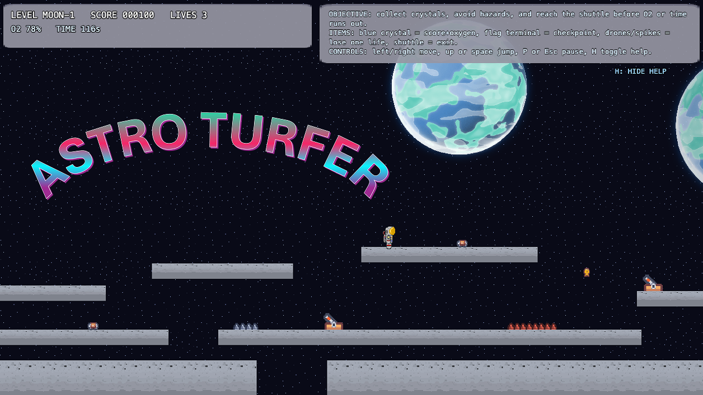

# Astro Turfer

Web-first Phaser 3 platformer where an astronaut surfs across Moon, Mars, and Europa-style obstacle courses.



## Play

Local development:

```bash
npm install
npm run dev
```

Open `http://localhost:5173`.

Production build:

```bash
npm run build
```

## Controls

- `Left` / `Right`: move
- `Up` or `Space`: jump
- `P` or `Esc`: pause
- `H`: toggle help

## Gameplay

- Collect crystals to increase score and recover oxygen.
- Activate flag terminals to set checkpoints.
- Avoid drones, spikes, lava, and ground gaps.
- Reach the shuttle before oxygen or time runs out.

## GitHub Pages

This repo is configured for GitHub Pages project hosting at:

- [https://deanp70.github.io/astro_turfer/](https://deanp70.github.io/astro_turfer/)

Deployment uses the workflow in [deploy.yml](/Users/dean/Talos/opencode_workspace/game_dev/.github/workflows/deploy.yml). Pushes to `main` trigger a fresh build and deploy.

GitHub repo setup:

1. Push this project to `deanp70/astro_turfer`.
2. In GitHub repo settings, open `Pages`.
3. Set the source to `GitHub Actions` if GitHub has not done that automatically.

## Credits

- Astronaut / shuttle / lunar platform art: [amizg](https://amizg.itch.io/)
- Asset credit requested by the artist: [https://amizg.itch.io/](https://amizg.itch.io/)
- Additional art and sound packs: [Kenney](https://kenney.nl/)

Detailed asset notes are in [ASSET_LICENSES.md](/Users/dean/Talos/opencode_workspace/game_dev/docs/ASSET_LICENSES.md).

## License

Source code is licensed under the MIT License. See [LICENSE](/Users/dean/Talos/opencode_workspace/game_dev/LICENSE).
